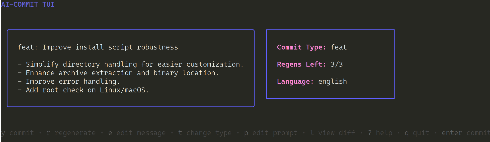

# AI-Commit



**AI-Commit** is a powerful CLI tool designed to revolutionize your Git workflow by leveraging AI for three key tasks: generating commit messages, providing basic code reviews, and enforcing commit message style guides. By integrating cutting-edge AI models, AI-Commit helps you create meaningful, Conventional Commits-compliant messages, get quick feedback on your code changes, and ensure your commit messages adhere to a high standard of clarity and informativeness—all right from your terminal.

It supports:

- **OpenAI**
- **Google Gemini**
- **Anthropic Claude**
- **DeepSeek**
- **Phind** (current model is free)
- **Ollama** (local AI models)

Boost your commit quality, enforce standards, and save valuable time with AI-Commit, your all-in-one AI assistant for Git workflows.

[https://github.com/renatogalera/ai-commit](https://github.com/renatogalera/ai-commit)

---

## 🛠️ Installation

You can install **AI-Commit** using one of two methods: via our automated installation script or by building from source.

### Automated Installation via Script

The installation script will:

- **Detect** your operating system and CPU architecture.
- **Fetch** the latest release of AI-Commit from GitHub.
- **Download** the appropriate binary asset.
- **Set** the executable permission.
- **Install** the binary to `/usr/local/bin` (using `sudo` if required).

To install via the script, run the following commands in your terminal:

```bash
curl -sL https://raw.githubusercontent.com/renatogalera/ai-commit/main/scripts/install_ai_commit.sh | bash
```

*Note*: If you are not running as root, the script will prompt for your password to use `sudo` when moving the binary.

### Building from Source

If you prefer to build AI-Commit manually from source, follow these steps:

```bash
git clone https://github.com/renatogalera/ai-commit.git
cd ai-commit
go build -o ai-commit ./cmd/ai-commit
# Optionally, move the binary into your PATH for global access:
sudo mv ai-commit /usr/local/bin/
```

---

## ✨ Key Features

- **AI-Powered Commit Messages**: Automatically generate insightful and Conventional Commits-compliant messages using top AI providers (OpenAI, Google, Anthropic, DeepSeek, and now Phind).
- **AI Code Reviewer (Subcommand)**: Get basic, AI-driven code reviews directly in your terminal. Identify potential style issues, refactoring opportunities, and basic security concerns before committing. Use the `ai-commit review` subcommand to analyze your staged changes.
- **AI Commit Message Style Guide Enforcer (`--review-message`)**: Automatically review and enforce your commit message style using AI. Get feedback on clarity, informativeness, and overall quality to ensure consistently excellent commit messages. Enable with the `--review-message` flag during commit message generation.
- **Interactive TUI**: Refine commit messages in an enhanced, user-friendly Text User Interface. Regenerate messages, change commit types, edit prompts, view the full diff, and now also benefit from AI-driven style review feedback—all within the TUI.
- **Non-Interactive Mode (`--force`)**: Automate commit message generation and style enforcement in scripts or workflows, bypassing the TUI for quick, direct commits.
- **Semantic Release (`--semantic-release`)**: Streamline your release process with AI-assisted semantic version bumping. Choose between AI-suggested version updates or manual version selection via TUI (`--manual-semver`).
- **Interactive Commit Splitting (`--interactive-split`)**: Gain granular control over your commits with chunk-based staging and commit message generation for partial commits.
- **Emoji Support (`--emoji`)**: Add a touch of visual flair to your commit history with automatically included emojis based on commit types.
- **Customizable Templates (`--template`)**: Tailor commit messages to your team's style with custom templates, incorporating dynamic values like branch names.
- **Multi-Provider AI Support**: Choose the best AI for each task by switching seamlessly between OpenAI, Google, Anthropic, DeepSeek, and Phind.
- **Configurable and Filterable**: Adapt AI-Commit to your projects with customizable commit types and prompt templates. Filter lock file diffs for cleaner, AI-focused message generation and reviews.
- **Diff View in TUI**: Inspect complete Git diffs within the TUI (`l` key) for thorough pre-commit reviews.
- **Enhanced Splitter UI**: Benefit from improved interactive splitting with chunk selection inversion and clear status updates.

---

## ⚙️ Configuration

AI-Commit automatically creates a `config.yaml` file at `~/.config/ai-commit/config.yaml` upon first run. This file lets you personalize default settings:

```yaml
# Your name and email address for git commits.
authorName: "Your Name"
authorEmail: "youremail@example.com"

provider: "phind"

phindApiKey: ""             # Phind does not require an API key by default
phindModel: "Phind-70B"      # Current Phind model is free
phindBaseURL: "https://https.extension.phind.com/agent/"

openAiApiKey: "sk-YOUR-OPENAI-KEY"
openaiModel: "gpt-4o-latest"
openaiBaseURL: "https://api.openai.com/v1"

googleApiKey: "YOUR-GOOGLE-KEY"
googleModel: "models/google-2.0-flash"
googleBaseURL: "https://generativelanguage.googleapis.com"

anthropicApiKey: "sk-YOUR-ANTHROPIC-KEY"
anthropicModel: "claude-3-5-sonnet-latest"
anthropicBaseURL: "https://api.anthropic.com/v1"

deepseekApiKey: "YOUR-DEEPSEEK-KEY"
deepseekModel: "deepseek-chat"
deepseekBaseURL: "https://api.deepseek.com/v1"

ollamaBaseURL: "http://localhost:11434"
ollamaModel: "llama2"

semanticRelease: false
interactiveSplit: false
enableEmoji: false
commitType: ""
template: ""
promptTemplate: "" # Customize the AI prompt template for commit messages, reviews, and style checks
commitTypes:
  - type: "feat"
    emoji: "✨"
  - type: "fix"
    emoji: "🐛"
  - type: "docs"
    emoji: "📖"
  - type: "style"
    emoji: "🎨"
  - type: "refactor"
    emoji: "♻️"
  - type: "test"
    emoji: "🧪"
  - type: "chore"
    emoji: "🔧"
  - type: "perf"
    emoji: "⚡"
  - type: "build"
    emoji: "📦"
  - type: "ci"
    emoji: "🚀"

lockFiles: # Specify lock files to be ignored in diffs for commit messages and reviews
  - "go.mod"
  - "go.sum"
```

> **Note**: Command-line flags always take precedence over configuration file values. API keys can be set via environment variables or within `config.yaml`. You can now also customize the `promptTemplate` in this file to adjust the behavior of both commit message generation and code reviews.

API Keys via Environment Variables:

- `OPENAI_API_KEY`
- `GOOGLE_API_KEY`
- `ANTHROPIC_API_KEY`
- `DEEPSEEK_API_KEY`
- `PHIND_API_KEY`

---

## 🚀 Basic Usage

1.  **Stage your changes**:
    ```bash
    git add .
    ```

2. **Commit Message Generation**     
    ```bash
    ai-commit
    ```
    Standard interactive commit message generation, without style review.

    -   **Confirm Commit**: `Enter` or `y` to commit with the generated message.
    -   **Regenerate Message**: `r` to generate a new commit message. Track regen attempts in the UI.
    -   **Change Commit Type**: `t` to select a different commit type, influencing AI generation.
    -   **Edit Message**: `e` to manually edit the commit message in the TUI (`Ctrl+s` to save, `Esc` to cancel).
    -   **Edit Prompt**: `p` to customize the AI prompt text for specific instructions (`Ctrl+s` to apply, `Esc` to cancel).
    -   **View Diff**: `l` to review the full Git diff within the TUI (`Esc` or `q` to return).
    -   **Help**: `?` to toggle help text showing keybindings.
    -   **Quit**: `q`, `Esc`, or `Ctrl+C` to exit without commit.
    -  **AI Style Review Feedback**: When using `--review-message`, any style feedback from the AI will also be displayed in the TUI (feature to be implemented in future versions for interactive feedback). For now, feedback is shown in the terminal output before the TUI.

---

## 🎛️ Command-Line Flags

**Main Flags**:

*   `--provider`: AI provider selection (`openai`, `google`, `anthropic`, `deepseek`, `phind`, `ollama`).
*   `--model`: Specific model choice per provider (e.g., `gpt-4`, `models/google-2.0-flash`, `claude-3-5-sonnet-latest`, `deepseek-chat`, `Phind-70B`, `llama2`).
*   `--apiKey`, `--googleApiKey`, `--anthropicApiKey`, `--deepseekApiKey`, `--phindApiKey`: API keys for each provider.
*   `--openaiBaseURL`, `--googleBaseURL`, `--anthropicBaseURL`, `--deepseekBaseURL`, `--phindBaseURL`, `--ollamaBaseURL`: Base URLs for each provider (Ollama defaults to http://localhost:11434).
*   `--commit-type`: Force a commit type (e.g., `fix`, `feat`) for non-interactive use or AI guidance.
*   `--template`: Custom template for commit messages, wrapping AI output.
*   `--prompt` *(Deprecated)*: Use `promptTemplate` in `config.yaml` for persistent prompt customization instead.

**Workflow Control Flags**:

*   `--force`: Non-interactive commit; skips TUI and commits directly.
*   `--semantic-release`: Enables semantic versioning; suggests/creates version tags post-commit.
*   `--manual-semver`: With `--semantic-release`, manually select version type in TUI.
*   `--interactive-split`: Launches chunk-based commit splitting TUI.
*   `--emoji`: Adds emojis to commit messages based on type.
*   `--review-message`: Enable AI-powered commit message style review. After generating a commit message, AI-Commit sends it to AI for a style review. Feedback is provided in the terminal output, ensuring commit messages are clear, informative, and adhere to best practices.

**Subcommand**:

*   `review`: Trigger AI-powered code review of staged changes:
    ```bash
    ai-commit review
    ```
*   `summarize`: **NEW** - Summarize a selected commit using AI. Uses `fzf` to pick a commit from the commit history, then displays an AI-generated summary of that commit.
     ```bash
     ai-commit summarize
     ```

---

## ✍️ More Examples


1.  **Summarize a Commit**:
    ```bash
    ai-commit summarize
    ```
    Lists commits with `fzf`, and after you pick one, shows an AI-generated summary in the terminal.

2.  **Interactive Commit with Style Review**:
    ```bash
    ai-commit --review-message
    ```
    Launches the interactive TUI after generating and AI-reviewing the commit message style.

3.  **Force Commit with Style Review (Non-Interactive)**:
    ```bash
    ai-commit --force --review-message
    ```
    Directly commits staged changes after generating and AI-reviewing the commit message style, skipping the TUI. Style review feedback is printed to the terminal before commit.

4.  **AI-Powered Code Review**:
    ```bash
    ai-commit review
    ```
    Executes AI code review and outputs suggestions to the terminal.

5.  **Semantic Release (Manual Version)**:
    ```bash
    ai-commit --semantic-release --manual-semver
    ```
    Semantic release with manual version selection TUI.

6.  **Provider and Model Selection**:
    ```bash
    ai-commit --provider=openai --model=gpt-4 --apiKey=sk-...
    ai-commit --provider=google --model=models/google-2.0-flash --googleApiKey=...
    ai-commit --provider=anthropic --model=claude-3-sonnet --anthropicApiKey=...
    ai-commit --provider=deepseek --model=deepseek-chat --deepseekApiKey=...
    ai-commit --provider=phind --model=Phind-70B           # Phind model is currently free; API key is optional
    ai-commit --provider=ollama --model=llama2 --ollamaBaseURL=http://localhost:11434  # Use local Ollama instance
    ```

7.  **Interactive Split Commit**:
    ```bash
    ai-commit --interactive-split
    ```
---
